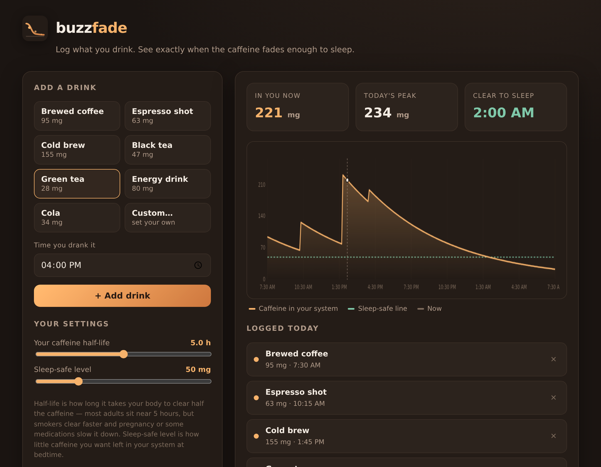

  

<h1 align="center">buzzfade</h1>

<em>Log what you drink. See exactly when the caffeine fades enough to sleep.</em>

  

## What it is

buzzfade turns your coffee habit into a picture. Add each drink and the time you had it, and it plots how much caffeine is still circulating hour by hour — then tells you the moment it drops below your personal sleep-safe line. No more guessing whether that 4pm cold brew is the reason you're staring at the ceiling at midnight.

It uses the same first-order half-life model clinicians use for caffeine (default 5-hour half-life, adjustable from 3 to 7 hours to match how fast *your* body clears it).

## Who it's for

- Coffee and energy-drink drinkers who love the buzz but hate the sleep debt
- Shift workers timing their last cup around an odd sleep schedule
- Students and night owls trying to wind down at a reasonable hour
- Anyone tracking a caffeine taper

## How to use it

1. Open `index.html` in any modern browser — that's it, no install, no account, nothing leaves your device.
2. Pick a drink (or set a custom mg amount) and enter the time you drank it.
3. Add as many as you like across the day.
4. Read the three numbers up top: how much is **in you now**, your **peak**, and the time you'll be **clear to sleep**.
5. Nudge the two sliders to match your own metabolism and your target bedtime level.

## Features

- Eight common presets (brewed coffee, espresso, cold brew, black & green tea, energy drink, cola) plus a custom milligram entry
- Live caffeine-over-24h curve with a sleep-safe threshold line and a "now" marker
- Adjustable half-life (3–7 h) and sleep-safe level (20–150 mg)
- "Clear to sleep" estimate that reacts instantly to every change
- Fully client-side and private — your log never leaves the browser
- Responsive layout, keyboard-friendly, works offline

## Notes

buzzfade is a planning estimate, not medical advice. Caffeine sensitivity varies a lot between people; treat the numbers as a helpful guide, not a prescription.

## License

MIT © brod-dev
